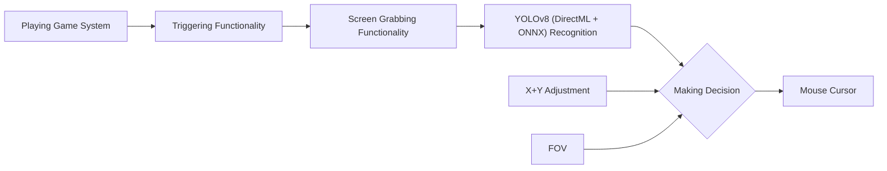

> [!NOTE]
> If you enjoy Aimmy, please consider giving us a star ⭐! We appreciate it! :)
  

    
  

Aimmy is a universal AI-Based Aim Alignment Mechanism developed by BabyHamsta, MarsQQ & Taylor to make gaming more accessible for users who have difficulty aiming.

Unlike most AI-Based Aim Alignment Mechanisms, Aimmy utilizes DirectML, ONNX, and YOLOV8 to detect players, offering both higher accuracy and faster performance compared to other Aim Aligners, especially on AMD GPUs, which would not perform well on Aim Alignment Mechanisms that utilize TensorRT.

Aimmy also provides an easy to use user-interface, a wide set of features and customizability options which makes Aimmy a great option for anyone who wants to use and tailor an Aim Alignment Mechanism for a specific game without having to code.

Aimmy is 100% free to use. This means no ads, no key system, and no paywalled features. Aimmy is not, and will never be for sale for the end user, and is considered a source-available product, **not open source** as we actively discourage other developers from making commercial forks of Aimmy.

Please do not confuse Aimmy as an open-source project, we are not, and we have never been one.

Want to connect with us? Join our Discord Server: https://discord.gg/aimmy

If you want to share Aimmy with your friends, our website is: https://aimmy.dev/

## Table of Contents
- [What is the purpose of Aimmy?](#what-is-the-purpose-of-aimmy)
- [How does Aimmy Work?](#how-does-aimmy-work)
- [Features](#features)
- [Setup](#setup)
- [How is Aimmy better than similar AI-Based tools?](#how-is-aimmy-better-than-similar-ai-based-tools)
- [How the hell is Aimmy free?](#how-the-hell-is-aimmy-free)
- [What is the Web Model?](#what-is-the-web-model)
- [How do I train my own model?](#how-do-i-train-my-own-model)
- [How do I upload my model to the "Downloadable Models" menu](#how-do-i-upload-my-model-to-the-downloadable-models-menu)

## What is the purpose of Aimmy?
### Aimmy was designed for Gamers who are at a severe disadvantage over normal gamers.
### This includes but is not limited to:
- Gamers who are physically challenged
- Gamers who are mentally challenged
- Gamers who suffer from untreated/untreatable visual impairments
- Gamers who do not have access to a seperate Human-Interface Device (HID) for controlling the pointer
- Gamers trying to improve their reaction time
- Gamers with poor Hand/Eye coordination
- Gamers who perform poorly in FPS games
- Gamers who play for long periods in hot environments, causing greasy hands that make aiming difficult 

## How does Aimmy Work?

When you press the trigger binding, Aimmy will capture the screen and run the image through AI recognition powered by your computer hardware. The result it develops will be combined with any adjustment you made in the X and Y axis, and your current FOV and will result in a change in your mouse cursor position.

## Features
1. Full Fledged UI
	- Aimmy provides a well designed and full-fledged UI for easy usage and game adjustment.
2. DirectML + ONNX + YOLOv8 AI Detection Algorithm
	- The use of these technologies allows Aimmy to be one of the most accurate and fastest Aim Alignment Mechanisms out there in the world
3. Dynamic Customizability System
	- Aimmy provides an interactive customizability system with various features that auto-updates the way Aimmy will aim as you customize. From AI Confidence, to FOV, to Anti-Recoil Adjustment, Aimmy makes it easy for anyone to tune their aim
4. Dynamic Visual System
	- Aimmy contains a universal ESP system that will highlight the player detected by the AI. This is helpful for visually impaired users who have a hard time differentiating enemies, and for configuration creators attempting to debug their configurations.
5. Adjustable Anti-Recoil
	- Aimmy offers an incredibly customizable Anti-Recoil system that's designed to be easy to use. With features like recording your Fire Rate, setting your X and Y adjustment, and Configuration Switch Keybindings
6. Mouse Movement Method
	- Aimmy grants you the right to switch between 5 Mouse Movement Methods depending on your Mouse Type and Game for better Aim Alignment
7. Hotswappability
	- Aimmy lets you hotswap models and configurations on the go. There is no need to reset Aimmy to make your changes
8. Model and Configuration Store with Repository Support
	- Aimmy makes it easy to get any models and configurations you may ever need, and with repository support, you can get up to date with the latest models and configurations from your favorite creators

## Setup
- Download and Install the x64 version of [.NET Runtime 8.0.X.X](https://dotnet.microsoft.com/en-us/download/dotnet/thank-you/runtime-desktop-8.0.2-windows-x64-installer)
- Download and Install the x64 version of [Visual C++ Redistributable](https://aka.ms/vs/17/release/vc_redist.x64.exe)
- Download Aimmy from [Releases](https://github.com/BabyHamsta/Aimmy/releases) (Make sure it's the Aimmy zip and not Source zip)
- Extract the Aimmy.zip file
- Run Aimmy.exe
- Choose your Model and Enjoy :)

## How is Aimmy better than similar AI-Based tools?
Aimmy is written in C# using .NET 8 and WPF utilizing pre-existing libraries like DirectML and ONNX. This has allowed us to make a very fast Aim Aligner with high compatiblity on both AMD and NVIDIA GPUs without sacrificing the end-user experience.

Beyond the core functionality, Aimmy also adds some amazing additional features like Detection ESP and Anti-Recoil to help you tune your gaming experience however you like it.

Aimmy comes pre-bundled with 2 well trained AI models with thousands of images each. 
1. Phantom Forces
2. Universal Model

Besides those 2 models, Aimmy provides dozens of other community made models through the store, with more models being developed every day by other Aimmy users. These models vary from game to image count, making Aimmy incredibly versatile and universal for thousands of games on the market right now.

## How the hell is Aimmy free?
As an AI based Aim Aligner, Aimmy does not require any sort of upkeep because it does not read any specific game data to perform it's actions. If Aimmy team stops maintaining Aimmy, even if no one pitches in to fork and maintain the project, Aimmy would still work.

This has meant that while we do currently use out of pocket expenses to run Aimmy, those expenses have been low enough that it hasn't been a necessity for Aimmy to run on even an ad-supported model.

We do not seek to make money from Aimmy, we only seek your kind words <3, and a chance to help people aim better, by assisting their aim or even to train how they aim (yes, you can use Aimmy in that way too)

## What is the Web Model
The web model is a TFJS (TensorFlow Javascript) export of the model. This allow you to use the model for image labeling, which then images can be sent to us to help further train the PF/Universal model or you can use those images to train your own YOLOv8 model.
You may wonder, "Why is it in YOLOv5 and not YOLOv8?". This is due to us using the tool called MakeSense, it to me is one of the easiest tools and is all web based. I am sure there are other tools that may accept the YOLOv8 web model.

You can visit MakeSense here: https://www.makesense.ai
You then can simply load all of your images in and select Object Detection.

Then run the AI locally, select YOLOv5, and upload all the web model files.

You can now go through your images and click and drag to highlight any Enemies on screen and approve the auto detected enemies from the web model:

Once you are finished labeling you'll want to export the labels for AI training:

## How do I train my own model
Please see the video tutorial bellow on how to label images and train your own model. (Redirects to Youtube)

## How do I upload my model to the "Downloadable Models" menu?

If you are not aware already, Aimmy contains a "Downloadable Models" tab that allows you to download models developed and shared by the Aimmy Community.

Aimmy pulls these models from the [Aimmy repository](https://github.com/Babyhamsta/Aimmy/tree/master/models), this means **anyone can upload models to the "Downloadable Models" tab by making a pull request**.

To start, please note that if you would like to be credited for your work, name your model as:
**[Game Name/Model Name]** by **[The Creator]**

If you would like to stay anonymous however, you may only list the Game Name/Model Name.

Now, fork the Aimmy Repository

After that, go to your fork's model folder

Press "Add File"

Drag your model onto the area that contains the text "Drag additional files here to add them to your repository"

and press "Commit Changes" when the green progress bar disappears

Now go to the "Pull requests" tab

Create a new pull request

Create the pull request

Create the pull request (again)

You are done! We will review your pull request and your model will be added in 24-48 hours. If you would like to remove your model from the "Downloadable Models" tab, you may make another pull request or contact us on the Issues tab.

For anyone who does this, thank you so much =D, Aimmy genuinely thrives with community contributions and support, and making and sharing your Aimmy models genuinely means a lot to us! Thank you!
